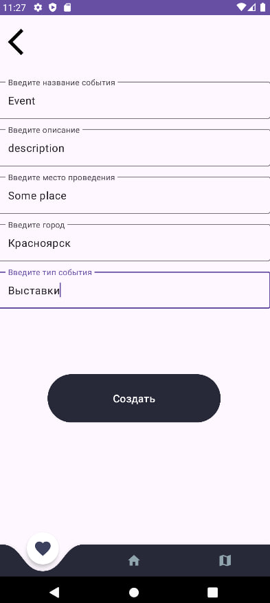

# Тема
 Тематикой приложения был выбран “Городской гид событий”. Приложение, которое позволяло бы пользователям отслеживать события в своём городе, обращаясь к публичному API, например, к “API KudaGo”. В качестве функционала для работы с БД выступает добавление и удаление записей с мероприятиями во вкладку “отслеживаемые”. Географическая карта используется для отображения мест в городе, в которых проходят некоторые события.
## Руководство пользователя
 Приложение включает в себя 4 страницы: домашняя страница, избранное, карта, настройки.

## Домашняя страница

 Домашняя страница содержит в себе название города и тип событий в верхней части экрана, представляя собою заголовок. Под заголовком находится поисковая строка, в которую 
пользователь может записать название или часть названия интересующего события для отображения событий в домашней страницы, соответствующих результатам поиска. 

 Также напротив поисковой строки находится кнопка настроек, по нажатию на которую пользователь перемещается в окно настроек.
 Под поисковой строкой находятся карточки событий, полученные из открытого API. Карточка содержит в себе изображение события, название, место проведения. Также на карточке
находятся кнопки управления событиями: "Пойду", "Показать", "Delete".

- Кнопка пойду добавляет событие в избранное, текст кнопки меняет на "Не пойду". Если нажать на кнопку ещё раз, то событие будет удалено из избранного и текст кнпки примет прежнее состояние. 

- Кнопка показать перемещает пользователя во вкадку детального просмотра записи, где представлено изображение события, название и описание.
- Кнопка Delete удаляет событие из домашней страницы, избранного, событие перестает отображаться на карте.

## Избранное

 Изначально вкадка избранное не содержит карточки событий, при нажатии на кнопку "пойду" события в виде карточек будут добавляться во вкладку избранного. Вид карточек такой же, как и в домашней странице.
 
## Детальный просмотр

 Вкладка детальный просмотр открывается при нажатии на кнопку "показать". Содержит в себе изображение события, название, описание, если представлено.

## Катра

 Карта содержит метки событий, по нажатию на метки происходит переход во вкладку детальный просмотр. 

## Настройки

 Во вкладке настройке можно выбирать город и тип события. Изменения применяются к событиям отображаемым на домашней странице и карте.
Также в правой нижней части экрана находится кнопка с плюсом, по нажатию на которую открывается страница добавления записи.

## Добавление записи

 Во вкадке добавления записи пользователь заполняет поля информацией о событии и нажимает кнопку создать для создания записи.

 Запись отображается на главной странице, и у неё появилась кнопка "edit", по нажатию на которую пользователь может отредактировать запись.

## Редактировние записей

 После того как пользователь нажал кнопку "edit", он может отредактировать интересующие поля и нажать кнопку "сохранить", чтобы сохранить запись.
